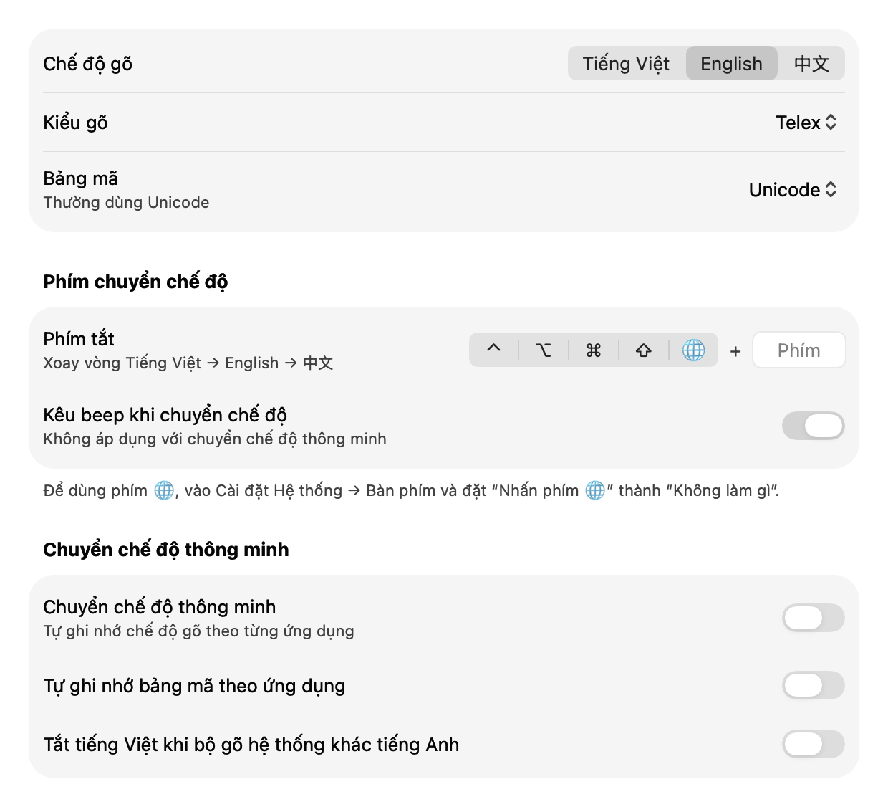

# OpenKey (bản fork của jetaudio)

[](https://github.com/jetaudio/OpenKey/actions/workflows/macos-dmg.yml)
[](https://github.com/jetaudio/OpenKey/actions/workflows/msbuild.yml)
[](LICENSE)

**Bộ gõ tiếng Việt nguồn mở cho macOS và Windows. Trên macOS có thêm chế độ gõ tiếng Trung bằng Pinyin.**

Đây là bản fork được duy trì của [OpenKey](https://github.com/tuyenvm/OpenKey) do Mai Vũ Tuyên phát triển.
Fork dựa trên `master` của bản gốc tại commit [`89c2fd3`](https://github.com/tuyenvm/OpenKey/commit/89c2fd3bf258562f2349f89b49d81e2f140c3fc3).
Fork bổ sung chế độ gõ tiếng Trung, giao diện macOS mới, các bản sửa lỗi lấy từ những pull request còn mở ở repo gốc, cùng bộ kiểm thử hồi quy và CI build tự động.

[English](README.en.md) · [Lịch sử thay đổi](CHANGELOG.md) · [Hướng dẫn build](BUILDING.md) · [Review PR gốc](PR_REVIEW.md)

<picture>
  <source media="(prefers-color-scheme: dark)" srcset="docs/images/preferences-dark.png">
  
</picture>

## Fork này có thêm gì so với OpenKey gốc

### Tính năng mới

- **Gõ tiếng Trung (macOS):** thêm chế độ thứ ba, **中**, để gõ Pinyin giản thể.
  - Dùng [librime](https://github.com/rime/librime) với bộ `pinyin_simp` chính thức.
  - Bảng ứng viên hiện ngay cạnh con trỏ.
  - Bộ gõ tự học cụm từ. **Shift+Delete** hoặc **Control+K** xóa một cụm đã học.
  - Phím tắt chuyển chế độ xoay vòng **Tiếng Việt → English → 中**.
- **Giao diện macOS mới:** bảng điều khiển, gõ tắt, chuyển mã và giới thiệu được thiết kế lại theo phong cách Cài đặt của macOS 26 (Tahoe).
- **Phím 🌐/Fn (macOS):** dùng được phím Fn riêng lẻ hoặc kết hợp với phím khác để chuyển chế độ.
- **Simple Telex 2 trên Windows:** có trong bảng điều khiển và menu khay hệ thống.

### Sửa lỗi độ ổn định

Các bản sửa này được tích hợp từ 8 PR còn mở ở repo gốc: #287, #289, #297, #317, #324, #329, #332 và #333. Mỗi PR đều được review, viết lại một phần và có kiểm thử. Chi tiết nằm trong [PR_REVIEW.md](PR_REVIEW.md).

- **Event tap (macOS):** tự bật lại khi macOS tắt nó do timeout, có watchdog 0,5 giây.
- **Gửi phím (macOS):** mỗi lần thay chữ tạo cặp sự kiện Backspace mới, và chuỗi dài được gửi theo từng khối UTF-16 trọn vẹn.
- **Spotlight:** chỉ thay chữ tại chỗ khi ô Spotlight thật sự đang nhận phím.
- **Khởi động cùng máy:** dùng `SMAppService` trên macOS 13 trở lên.
- **Ứng dụng lập trình:** Terminal và các ứng dụng tương tự mặc định gõ tiếng Anh, nhưng vẫn giữ lựa chọn và bảng mã người dùng đã lưu.
- **Windows:** tự cài lại hook bàn phím khi mở khóa máy, và sửa lỗi tràn bộ đệm cùng ký tự thừa khi dán qua clipboard.
- **Công cụ chuyển mã:** giữ chữ hoa/thường khi bỏ dấu, và vẫn giải mã đúng ký tự một byte của VNI/CP1258.
- **Chuyển chế độ:** bộ gõ tiếng Việt bắt đầu từ mới mỗi khi vào hoặc ra chế độ tiếng Trung.

### Kỹ thuật

- **Kiểm thử:** chạy với AddressSanitizer/UndefinedBehaviorSanitizer.
  - Engine có hơn 3.400 assertion, gồm cả cách đặt dấu kiểu cũ và kiểu mới.
  - Phía macOS có kiểm thử xử lý sự kiện phím, vòng đời event tap và gõ tiếng Trung.
- **CI:** GitHub Actions build DMG universal (`arm64` + `x86_64`) và file EXE Windows x86/x64.
- **Hiệu năng:** giảm khối lượng xử lý cho mỗi lần gõ phím.

## Tính năng kế thừa từ OpenKey

- **Kiểu gõ:** Telex, VNI, Simple Telex 1, Simple Telex 2.
- **Bảng mã:** Unicode dựng sẵn, TCVN3 (ABC), VNI Windows, Unicode tổ hợp, Vietnamese Locale CP1258.
- **Cách gõ:**
  - Bỏ dấu kiểu mới (`oà`, `uý`) hoặc kiểu cũ (`òa`, `úy`).
  - Kiểm tra chính tả, và tự khôi phục phím khi gõ sai từ.
  - Gõ nhanh: `cc`=ch, `gg`=gi, `kk`=kh, `nn`=ng, `qq`=qu, `pp`=ph, `tt`=th.
  - Gõ tắt phụ âm đầu (f→ph, j→gi, w→qu) và phụ âm cuối (g→ng, h→nh, k→ch).
- **Gõ tắt (macro):** không giới hạn độ dài, nhập và xuất được ra file.
- **Chuyển chế độ thông minh:** tự nhớ chế độ gõ và bảng mã theo từng ứng dụng.
- **Tạm tắt:** giữ Ctrl để tạm tắt kiểm tra chính tả, giữ Cmd/Alt để tạm tắt OpenKey.
- **Viết hoa:** tự viết hoa chữ cái đầu câu.
- **Công cụ chuyển mã:** chuyển văn bản giữa các bảng mã và đổi chữ hoa/thường, có phím tắt riêng.
- **Sửa lỗi gợi ý:** sửa lỗi tự hoàn thành trên trình duyệt và Excel.
- **Ngôn ngữ khác:** tùy chọn tắt tiếng Việt khi bộ gõ hệ thống không phải tiếng Anh.

## Yêu cầu hệ thống

- macOS 12 Monterey trở lên (Apple Silicon hoặc Intel).
- Windows Vista trở lên (x86 hoặc x64).

## Cài đặt

**macOS**

1. Tải `OpenKey-<phiên bản>-macOS-universal.dmg` từ [bản phát hành mới nhất](https://github.com/jetaudio/OpenKey/releases/latest). Bản dựng thử nằm ở artifact **OpenKey-macos-universal** của workflow [Build macOS DMG](https://github.com/jetaudio/OpenKey/actions/workflows/macos-dmg.yml). Bạn cũng có thể [tự build](BUILDING.md).
2. Mở DMG và kéo **OpenKey.app** vào **Applications**.
3. Bản build được ký ad hoc và chưa notarize. Lần đầu mở, hãy bấm chuột phải vào app rồi chọn **Open**, hoặc cho phép trong **Cài đặt Hệ thống → Quyền riêng tư & Bảo mật**.
4. Cấp quyền tại **Cài đặt Hệ thống → Quyền riêng tư & Bảo mật → Trợ năng**. Không tắt quyền này khi đang dùng OpenKey.

**Windows**

1. Tải `OpenKey-<phiên bản>-Windows.zip` từ [bản phát hành mới nhất](https://github.com/jetaudio/OpenKey/releases/latest), hoặc artifact **OpenKey** của workflow [MSBuild](https://github.com/jetaudio/OpenKey/actions/workflows/msbuild.yml).
2. Giải nén, rồi chạy `OpenKey64.exe` trên Windows 64-bit hoặc `OpenKey32.exe` trên Windows 32-bit. Riêng bản 2.0.5 để hai file này trong thư mục `x64/` và `x86/`.
3. Bấm đồng ý khi Windows hỏi quyền quản trị.

> [!IMPORTANT]
> Hãy tắt các bộ gõ tiếng Việt khác khi dùng OpenKey, vì hai bộ gõ chạy cùng lúc sẽ xung đột với nhau.

## Hướng dẫn nhanh

- **Chuyển chế độ:** dùng phím tắt cài trong **Phím chuyển chế độ**, hoặc chọn trên menu bar hay khay hệ thống.
- **Dùng phím 🌐 trên macOS:** vào **Cài đặt Hệ thống → Bàn phím** và đặt "Nhấn phím 🌐" thành **Không làm gì**.
- **Chế độ 中:**
  - Gõ Pinyin.
  - **Space** chọn ứng viên đầu tiên, phím **1–7** hoặc bấm chuột để chọn ứng viên khác.
  - **−/=** hoặc **Page Up/Page Down** để lật trang.
  - **Esc** để hủy.
  - Bật **Caps Lock** để gõ chữ Latin.

## Build và kiểm thử

Xem [BUILDING.md](BUILDING.md). Ngắn gọn như sau:

```bash
bash scripts/build-macos-dmg.sh    # build DMG vào dist/ (cần Xcode đầy đủ)
bash scripts/test-engine.sh        # kiểm thử engine gõ
bash scripts/test-macos-events.sh  # kiểm thử xử lý phím trên macOS
bash scripts/test-rime.sh          # kiểm thử gõ tiếng Trung
```

## Hạn chế đã biết

- **Chữ ký:** bản build chỉ ký ad hoc và chưa notarize.
- **Cập nhật tự động:** từ bản 2.0.6, app kiểm tra bản mới trên repo này. Bản 2.0.5 vẫn đọc `version.json` của repo gốc, nên sẽ không tự báo có bản mới; hãy tải 2.0.6 từ trang Releases. Trên macOS, bấm "Có" sẽ mở trang tải DMG. Updater Windows chỉ tự thay `OpenKey64.exe`.
- **Chưa kiểm thử tương tác lâu dài:** các tình huống sau chưa được thử bằng tay trong thời gian dài. Kiểm thử tự động chỉ dùng mock cho các tương tác hệ thống này.
  - gõ trong Apple Mail, WebKit và Spotlight
  - sleep/wake
  - Login Items
  - khóa/mở khóa trên Windows
- **Tiếng Trung:** chỉ có trên macOS và chỉ hỗ trợ Pinyin giản thể.
- **Linux:** bản Linux không được duy trì trong fork này.

## Đóng góp

Rất hoan nghênh issue và pull request. Hãy tạo nhánh từ `master`, giữ thay đổi gọn gàng, thêm kiểm thử trong `tests/` khi thay đổi hành vi, và chạy các script kiểm thử trước khi gửi PR. Các bản sửa cho engine dùng chung cũng có thể gửi về [repo gốc](https://github.com/tuyenvm/OpenKey).

## Giấy phép

OpenKey là phần mềm tự do theo giấy phép [GNU GPL v3.0](LICENSE). Đúng như giấy phép yêu cầu, bản fork này vẫn là mã nguồn mở và ghi rõ bản gốc là OpenKey.

App macOS có kèm các thành phần sau:

- librime (BSD 3-Clause)
- rime-prelude và rime-essay (LGPL-3.0)
- rime-pinyin-simp (Apache-2.0)

Văn bản giấy phép nằm trong `OpenKey.app/Contents/Resources/Rime/licenses`.

## Ghi nhận

- **Mai Vũ Tuyên** là tác giả và người duy trì [OpenKey](https://github.com/tuyenvm/OpenKey). Bạn có thể [ủng hộ tác giả gốc tại đây](https://tuyenvm.github.io/donate.html).
- Các bản sửa lỗi được tích hợp từ PR của: hungmtuci, duyhnynh, Quocker22, luatnd, uponatime2019, nhutuananh, kurokeita và quyleanh.
- Dự án [RIME](https://rime.im) cung cấp engine và dữ liệu gõ tiếng Trung.
